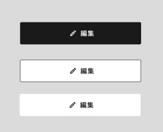

## 課題：ボタンコンポーネントの実装

アプリケーション内で共通して使用するボタンコンポーネントを実装してください

### 仕様

- ボタンのパターンとしては次の3つがあります。
    
    
    
    - ボタンのラベルはテキストのみの場合と、左右にアイコンが付く場合があります。
- ボタンには次の4種類の状態があります。
    - 非活性
    - ローディング中
    - ホバー時
    - フォーカス時
- ボタンのラベルは外部から指定することができます。
- ボタンのクリック時に発火する関数は外部から指定することができます。
- ボタンの色や形は外部から指定することはできません。
- ボタンの高さ、横幅は親コンポーネントから制御できます。
- フォーム内で使用することもあるため、ボタンのtypeを `submit`に指定することができます。
- ボタンにURLを渡したときは、ボタンの見た目のまま、リンクとして振る舞います。
    - リンクとして振る舞うときは、リンクを開く先として `target` を指定することができます
- ボタンコンポーネントを使う側は宣言的に記述できるようにしてください。

実装されたボタンを全パターン見ることができるページを作成してください。

### 制約

**Must**

- [React](https://reactjs.org/) または [Vue.js](https://vuejs.org/index.html)を用いて実装すること（バージョンはできるだけ最新版を使用）
    - Nuxt.jsやNext.jsなどこれらを内包したフレームワークでも可
- PC/スマートフォン表示に対応すること(レスポンシブデザイン対応)
    - 実機ではなく、Google Chromeの検証ツールを用いた確認でよい
- styleは自分で記述し、CSS・UIフレームワークなどは使用しないこと
    - css-in-jsやcss-modules, Zero Runtime CSS, Sassなどの利用は可

**Prefer**

- TypeScriptで記述する
- linterやformatterを適切に設定する
    - linterにはESLint、formatterにはPrettierを使用する
- テストケース/テストコードを作成する（テストツールは任意）
- テスト実行時にエラーが発生しない

### 課題のレビュー観点

- 仕様を満たしていること
- フロントエンドの実装力
- CSSの記述力
- 設計
- 変数の命名規則
- チーム開発を意識できていること

### 注意事項

- ソースコードはGitで管理し、作成したソースコードはGitHubにアップロードしてください
- セキュリティを考慮してコードを記述してください
- Gitコミットメッセージやコミット粒度、ドキュメンテーション等もレビュー対象となります
- Google Chrome最新版で正しく動くことを確認してください

## 課題の提出方法

GitHubのpublicリポジトリのURLと、実装したWebアプリのURLの提出をお願いします。実装したWebアプリはNetlify / GitHub Pages / Firebase hosting / Vercel / Cloudflare Pages等のホスティングサービスにデプロイし、インターネット経由で閲覧できる状態にして共有してください。

作業全てにかかった時間も併せてお知らせください。